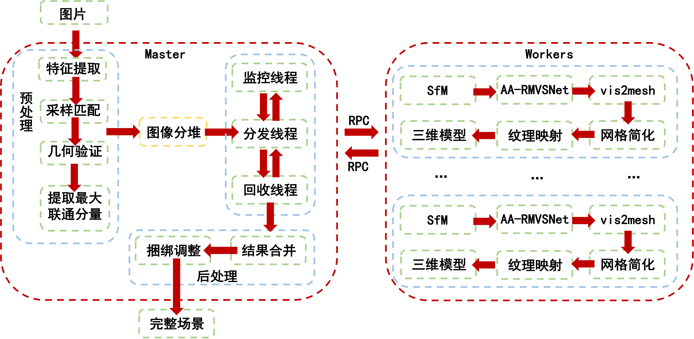
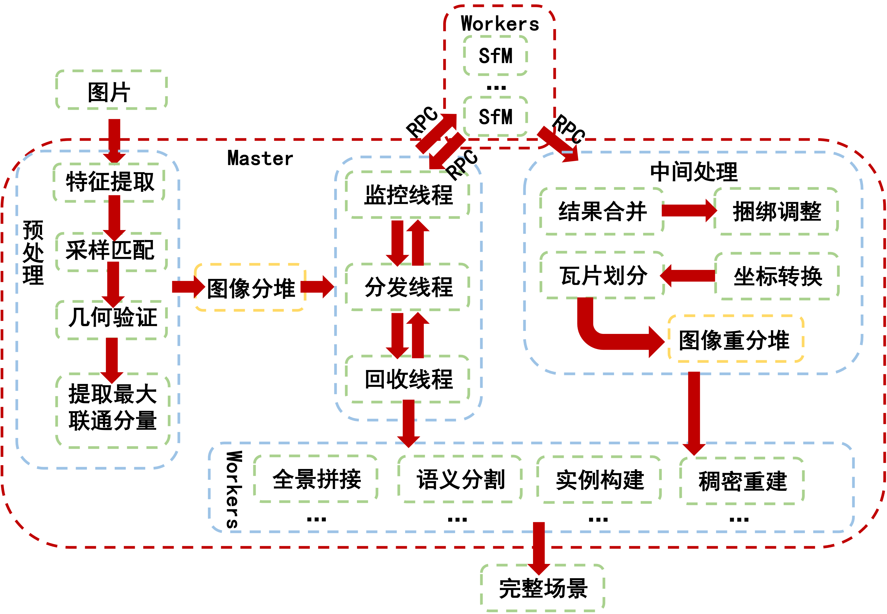

# 系统版本

系统源码主要包括三个存储位置，分别是gitlab代码仓库（服务器ip:8.140.146.21，苏迈负责管理）、东信云服务器（同步较慢）、服务器本地容器快照。

以托管在gitlab上的源码为基准，目前共有两个不同版本，分别为

+ master分支版本
+ dev分支版本

它们也分别对应**老流程**、**新流程**

老流程指的是在章焕与徐军二人构建的i23d分布式三维重建系统的基础上，集成实验室他人研究成果后的完整重建系统。其对于大部分拍摄质量较高的场景，如建筑、地标、百货等，理论上都能进行高质量的完整重建。对于高难度场景，例如森林、沙漠、水面、雪地等，则有一定的重建困难。可重建范围基本对标ContextCapture。新流程指在此基础上增加图片语义分割、全景图拼接、场景层次化分割的流程，在建筑物较少的场景内有更高的重建效率。

## [master分支版本](http://8.140.146.21/youweikang/dist_i23d/-/tree/main)

master分支版本为稳定可用的i23d分布式三维重建系统，系统结构如下：

## [dev分支版本](http://8.140.146.21/youweikang/dist_i23d/-/tree/dev)

dev分支版本为结合语义的i23d分布式层次化三维重建系统。系统结构如下：

## 本地服务器位置信息

北大有线网的网段为162.105.x.x，在非自行构建内网时均为公网ip。实验室1326房间的子网为162.106.86.x，此屋内设备数量较多，故不能保证每台设备拥有固定ip。通常在大规模断电等突发意外后可能会造成ip变化，需要主动连接显示器查看新ip（也可能无法获得ip）。尽量不要长期关闭服务器防止ip被收回。交流363房间内入口侧网线的子网为162.105.101.x，设备数量少，ip充足。内侧（三层主机支架处）子网为162.105.98.x，ip充足，但常出现各种意外断电或断连现象，可能与交换机性能有关。陈老师办公室内部休息室有六台运行*ContextCapture*的windows服务器。其无公网ip，均为路由器内网（192.168.x.x）。

后续不再赘述服务器位置，仅以子网作为区分。

二三维重建组主要的重建服务器如下（配置仅凭记忆，若有错误请及时修改）：

+ 86.72主服务器：56核E5，256G内存，GTX 1080ti，16TB硬盘。曾用ip为86.90，故早期wiki等文档内称为90服务器。是二三维重建组资料保存最为完整的服务器，通常能找到大部分历史存档。该服务器并行能力强，通常兼任i23d的Master服务器与Worker服务器。账号为gil-cpu，密码为zhuangfa777，曾经遭遇挖矿病毒，建议采用私钥登录。
+ 101.153、98.166：CPU为i7（9代左右），64G内存，RTX 2070S，6TB硬盘。153服务器郑中天通常也有使用需求，故使用前须与其沟通。166可随意使用。两者通常均为Worker服务器。账密均为graphics1/2（账号可能不带数字，仅为graphics）。
+ 98.15、98.16、98.17：CPU为i7（6-9代），64G内存，GTX 1060-RTX 2070S，6TB硬盘。其均已备案并可在校外访问。备案具体信息询问雷静文老师。其上部署了东信云系统，也曾布置过i23d流水线，可自行尝试测试。硬盘内数据可能被重置过，机械硬盘可能尚未装载，需要自行mount。曾经作为worker服务器使用，但目前较少使用，建议询问江西林同学。东信云工作人员也可使用VPN访问这三台服务器。账号均为root，密码：15-graphics3，16-graphics5，17-graphics6。
+ 101.201：CPU为i7，32（64？）G内存，GTX 1080ti，6TB硬盘。次

<!-- 
dev分支版本为稳定可用的i23d分布式三维重建系统，变更如下：

+ 集成了D2HC-RMVSNet（可替换原始改造的分布式版openMVS，默认仍然使用openMVS）
+ 增加sampling_based匹配和BA算法（徐军学长的毕业论文）
+ 增加sobel算子的头文件
+ 修改了log日志系统的生成路径

此分支版本额外上传了build文件夹，即已编译后的运行文件。使用时需要删除build文件夹并重新build。

## 90服务器版本

90服务器版本为最新测试版的i23d分布式三维重建系统，同样可用，对入口参数做了优化调整增加鲁棒性。 -->
